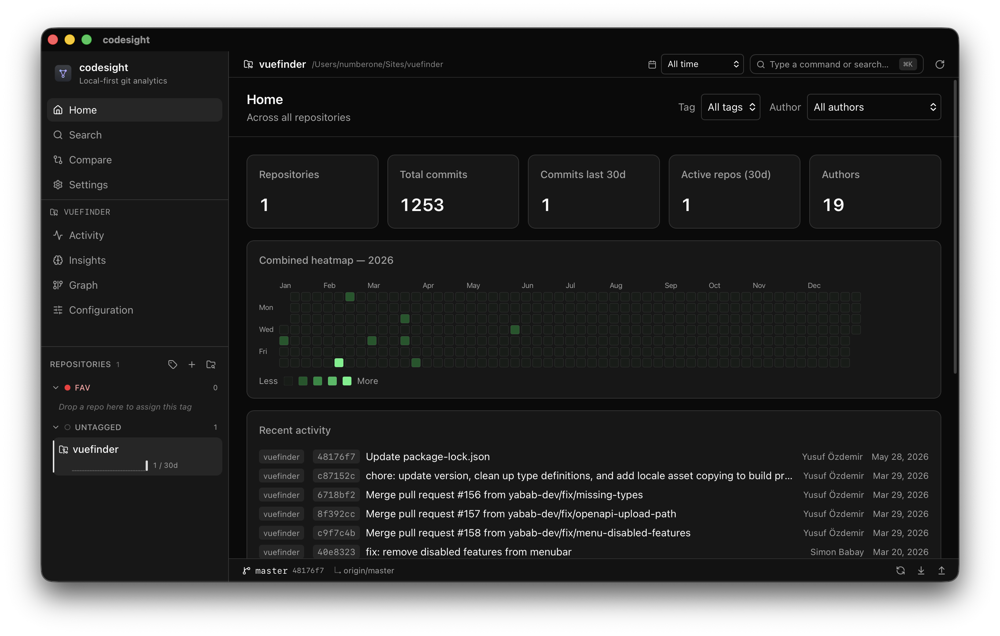

# codesight

> **Local Git Intelligence Layer.** A free, offline desktop app that turns your `.git` directories into deterministic metrics, heuristic insights, and graph-aware structural views — no GitHub account, no API tokens, no network calls.

Built with **React + Rust + Tauri**. Single binary; no system git or sqlite required.

- Repository: <https://github.com/n1crack/codesight>
- Homepage: <https://codesight.ozdemir.be>
- License: **AGPL-3.0** — source-available, modifications must be released under the same license



---

## Why codesight?

- **Replace GitHub Insights for offline / private workflows** — same questions answered, your code never leaves the laptop.
- **Audit repositories without cloud exposure** — point it at a `.git` directory, get bus factor, ownership maps, churn risk, in seconds.
- **Detect code ownership concentration and bus-factor risk** — surface single points of failure before they bite.
- **Surface churn-heavy hotspots before they become maintenance debt** — high-churn × concentrated-ownership × recent files are flagged automatically.
- **Analyze unlimited repositories locally with zero SaaS dependency** — no per-seat fee, no per-repo limit, no rate limit, no quotas.

---

## Privacy by design

- **No telemetry.** Nothing about your usage, repos, code, or identity is reported anywhere.
- **No cloud sync.** Nothing leaves the machine.
- **No code upload.** Diffs, commit messages, file paths — all stay local.
- **No external API calls.** No GitHub, no analytics, no error reporters, no fonts/assets fetched at runtime.
- **All analysis runs entirely on-device** — `git2` (vendored libgit2) reads `.git` directly; results live only in your local SQLite at `~/Library/Application Support/codesight/codesight.sqlite` (or the equivalent on your OS).

The app ships as a single self-contained binary. There is no system git or sqlite dependency, no node runtime, no network permissions in the Tauri capabilities other than file-system dialogs.

---

## The three pillars

codesight is organized around three coherent axes. Every metric, every page, every backend command belongs to exactly one of them.

### 1. Activity — *deterministic*

Counts and rates that are exact, reproducible, and judgment-free.

- **Heatmap** — year-by-year contribution heatmap, custom SVG with hover tooltips
- **Timeline** — commits or churn (additions/deletions) by day / week / month
- **Patterns** — hour × day-of-week distribution, "when does this team work"

### 2. Insights — *heuristics*

Opinionated reads of the same git data — judgment baked in, with the formula always visible.

- **Health** — composite **Repo Health Score** (0–100) from six weighted sub-scores: recency, activity volume, bus factor, branch hygiene, docs/tests presence, conventional commits. Color-coded gauge + breakdown with localized "why this score" hints.
- **Hotspots** — four views: Files / Directories / Couplings (pairs that change together) / **Churn Risk** (file-level risk = churn × ownership concentration × recency)
- **Ownership** — bus factor, top author shares, per-file primary author, and **Concentration Alerts**: bus-factor-of-one warnings, ≥80% single-owner files, alumni contributors (≥90 days idle)
- **Authors** — full contributor list with personal drill-down; **Contributor Volatility** stacked area chart shows active / new / returning authors per month
- **Collaborators** — co-authored commit pairs parsed from `Co-Authored-By` trailers
- **Messages** — conventional commit type distribution + avg subject length
- **Quality & Security** — five-group repo scan (hygiene · secret exposure · dependency hygiene · code hygiene · authorship) + a prioritized **Suggestions** list. Optional **Deep History Secret Scan** walks every commit blob with a live progress bar. The Quality dimensions feed back into the Health score (50/50 weighted with activity health).
- **Config** — read-only view of `user.name` / `user.email` (local + global fallback), `init.defaultBranch`, `commit.gpgSign`, core flags, remotes (fetch / push URLs), and installed `.git/hooks` with executable status

### 3. Graph — *git graph intelligence*

DAG-aware analysis: structure, refs, ancestry.

- **DAG** — gitk-style commit graph across all branches, lane layout, ref labels (HEAD / branches / tags)
- **Branches** — local & remote, HEAD pin, ahead/behind vs. default, stale-branch filter, **Stale-Branch Risk badges** (low/medium/high) based on per-branch unique commits — flags potential lost work
- **Releases** — chronological tags with tagger, message, commits-since-previous
- **Co-change network** (`/graph/couplings`) — force-directed graph of files that change together; nodes sized by degree, edges weighted by joint changes
- **Ownership treemap** (`/graph/ownership-map`) — squarified treemap where tile size = total commits and color = primary author
- **Import dependency graph** (`/graph/imports`) — parses TS/JS/Rust/Python imports and renders a directed module dependency graph

---

## Cross-repo

- **Home** — combined contribution heatmap across all repos, aggregated stats (total commits, last-30-day activity, active repo count, distinct authors), cross-repo activity feed with repo badges, per-author and per-tag filter
- **Search** — multi-filter commit search (message text, author email, date range, file path)
- **Compare** — multi-select repos, side-by-side stats and merged monthly chart
- **Tag overview** (`/tags/:id`) — aggregated stats across every repo carrying a given tag, with the repo list inline

---

## Drill-downs

- **`/commits/:oid`** — full commit detail: subject + body, parents (linkable), author/committer, file count + insertions/deletions, per-file collapsible diff with red/green line highlighting and binary-file detection
- **`/contributors/:email`** — per-author dashboard: 5 stat cards, personal year-by-year heatmap, top files, recent commits

---

## UX

- **English / Turkish** (react-i18next; default English, easy to extend)
- **Light / dark / system theme** with custom OKLCH palette, themed scrollbars
- **`⌘K` / `Ctrl K`** command palette — jump to any page (top-level + sub-tabs) or repo, with live match highlighting on results
- **Resizable, scrollable sidebar** — drag the divider, double-click to reset; tag-grouped repo list with collapsible groups
- **Drag-and-drop tag organization** (`@dnd-kit`) — reorder repos within a group or move them between tag groups; portaled drag overlay follows the cursor anywhere on screen, optimistic cache update keeps the drop landing exactly where you released it
- **OS-level folder drop** — drag any folder from Finder / Explorer onto the window. Auto-discovers nested git repos, opens a confirmation modal with optional tag picker (with inline "create new tag"), or surfaces a "no `.git` found" dialog if nothing matched
- **Inline tag creation** — every place that asks "which tag?" lets you make one on the spot with name + color
- **Side-by-side diff** — independent left/right horizontal scroll per pane, vertical alignment preserved; syntax highlighted via Shiki
- **Open-in-editor** — pick your default editor in Settings (VS Code, Cursor, Sublime, Zed, JetBrains family, Helix, system-default), then click the `↗` next to any file path in Hotspots / Diff / Quality / etc.
- **Repo filter** appears when 6+ repos (supports `#tag` syntax)
- **Refresh button** in the top bar invalidates all cached queries
- **Custom chart tooltips** — instant, themed, performant (mouse-position update is DOM-only, never re-renders React)
- **Click any commit hash anywhere** to drill into the commit detail page
- Skeleton loaders, page fade transitions, code-split routes

---

## Tech stack

**Frontend**
- Vite + React 19 + TypeScript
- Tailwind CSS v4 (manual UI primitives, no shadcn CLI)
- react-router-dom v7 (nested routes for sections)
- @tanstack/react-query
- @dnd-kit/core + sortable + utilities (sidebar drag-and-drop)
- recharts + custom SVG (heatmaps, DAG, sparklines)
- shiki (lazy-loaded, per-language chunks for diff syntax highlighting)
- lucide-react
- react-i18next + i18next-browser-languagedetector
- Lazy-loaded routes (manualChunks: recharts / i18n / react / tanstack)

**Backend**
- Tauri 2
- git2 with `vendored-libgit2`
- rusqlite with bundled SQLite (incl. analysis cache keyed on HEAD oid)
- rayon (cross-repo parallelism)
- chrono, walkdir, parking_lot, anyhow, thiserror
- Native OS file-drop via `Webview::onDragDropEvent`
- Editor launch via `std::process::Command` with a strict whitelist of binaries

**Plugins**
- `tauri-plugin-dialog` (file picker)
- `tauri-plugin-opener`

---

## Getting started

### Prerequisites

- Node.js 20+
- pnpm 10+
- Rust 1.80+ (`cargo` on PATH)
- Platform tooling for Tauri:
  - **macOS:** Xcode Command Line Tools
  - **Windows:** MSVC build tools + WebView2 runtime
  - **Linux:** webkit2gtk + librsvg + build-essential

### Install

```bash
pnpm install
```

### Run in dev mode

```bash
pnpm tauri dev
```

### Production build

```bash
pnpm tauri build
```

Bundle in `src-tauri/target/release/bundle/`.

### Type-check / build (frontend only)

```bash
pnpm build
```

---

## Project structure

```
codesight/
├── src/                       # React app
│   ├── api.ts                 # Tauri command wrappers
│   ├── types.ts               # TS types mirroring Rust structs
│   ├── i18n/                  # English + Turkish locales
│   ├── components/
│   │   ├── ui/                # Button, Card, Select, Tabs, Input, Skeleton
│   │   ├── AppShell.tsx       # Sidebar + AppTopBar + outlet
│   │   ├── AppTopBar.tsx      # Cmd+K hint + refresh
│   │   ├── CommandPalette.tsx # Global ⌘K
│   │   ├── Sidebar.tsx        # 7-item nav + resizable repo list
│   │   ├── SectionShell.tsx   # Title + sub-tabs + outlet (used by sections)
│   │   ├── ChartTooltip.tsx   # Themed hover tooltip primitive (forwardRef)
│   │   ├── Heatmap.tsx        # Year contribution heatmap (custom SVG)
│   │   ├── DiffView.tsx       # Per-file collapsible diff
│   │   ├── Sparkline.tsx      # currentColor-aware bar chart
│   │   └── …
│   ├── pages/
│   │   ├── HomePage.tsx              # Cross-repo dashboard
│   │   ├── SearchPage.tsx            # Universal commit search
│   │   ├── ComparisonPage.tsx        # Cross-repo compare
│   │   ├── SettingsPage.tsx
│   │   ├── CommitDetailPage.tsx
│   │   ├── ContributorDetailPage.tsx
│   │   ├── HeatmapPage.tsx           # Activity → Heatmap
│   │   ├── TimelinePage.tsx          # Activity → Timeline
│   │   ├── PatternsPage.tsx          # Activity → Patterns (matrix + bars)
│   │   ├── HealthPage.tsx            # Insights → Health (gauge + breakdown)
│   │   ├── HotspotsPage.tsx          # Insights → Hotspots (4 sub-tabs)
│   │   ├── OwnershipPage.tsx         # Insights → Ownership (alerts + tables)
│   │   ├── ContributorsPage.tsx      # Insights → Authors (cohort + list)
│   │   ├── MessagesPage.tsx          # Insights → Messages
│   │   ├── GraphPage.tsx             # Graph → DAG
│   │   ├── BranchesPage.tsx          # Graph → Branches (with risk badges)
│   │   ├── TagsPage.tsx              # Graph → Releases
│   │   └── sections/
│   │       ├── ActivitySection.tsx
│   │       ├── InsightsSection.tsx
│   │       └── GraphSection.tsx
│   ├── state/                 # AppStateProvider (Context + localStorage)
│   └── lib/                   # graphLayout, format, useChartTooltip, cn
├── src-tauri/
│   ├── src/
│   │   ├── main.rs            # binary entry point
│   │   ├── lib.rs             # #[tauri::command] handlers + invoke_handler
│   │   ├── analysis/          # all git analytics, split by pillar
│   │   │   ├── mod.rs         # shared types + walk_diffs primitive
│   │   │   ├── activity.rs    # deterministic counts/rates
│   │   │   ├── contributor.rs # per-author drill-downs + cohort
│   │   │   ├── insights.rs    # health, hotspots, churn risk, ownership
│   │   │   ├── quality.rs     # quality & security scan
│   │   │   ├── graph.rs       # DAG / branches / tags
│   │   │   ├── imports.rs     # import dependency parsing
│   │   │   └── global.rs      # cross-repo aggregations (rayon)
│   │   ├── repo.rs            # add / scan / list / remove repository
│   │   ├── db.rs              # SQLite wrapper
│   │   └── error.rs           # AppError + Serialize
│   ├── capabilities/
│   ├── Cargo.toml
│   └── tauri.conf.json
└── package.json
```

---

## Backend command catalogue

Grouped by pillar; every command is a `#[tauri::command] async fn` wrapping `spawn_blocking`.

**Repo CRUD & organization** — `add_repository`, `list_repositories`, `remove_repository`, `reorder_repositories`, `scan_folder`, `discover_repos`, `add_discovered_repos`, `refresh_repo`, `get_repos_sparklines`, `list_known_authors`, `list_repo_tags`, `create_tag`, `update_tag`, `delete_tag`, `assign_tag`, `unassign_tag`, `set_tag_repos`, `get_git_config`, `open_in_ide`

**Activity** — `get_repo_summary`, `get_commit_heatmap`, `get_commit_timeline`, `get_code_churn`, `get_activity_patterns`, `get_recent_commits`, `get_top_contributors`, `get_language_breakdown`

**Insights** — `get_repo_health` (composite score with structured `HealthDetail` enum), `get_file_hotspots`, `get_directory_hotspots`, `get_file_couplings`, `get_churn_risk`, `get_ownership_report` (with `OwnershipAlert[]`), `get_commit_message_stats`, `get_contributor_detail`, `get_contributor_heatmap`, `get_contributor_top_files`, `get_contributor_recent_commits`, `get_contributor_cohort`, `get_coauthor_pairs`, `get_author_specialization`, `run_quality_scan`, `run_history_secret_scan` (emits `scan-progress` events)

**Graph** — `get_commit_graph`, `list_branches` (with `unique_commits` + `risk` per branch), `list_tags`

**Cross-repo / search / commit** — `get_global_summary`, `get_global_heatmap`, `get_global_recent_commits`, `search_commits`, `get_commit_detail`

---

## Architecture notes

- **Local-only.** No GitHub API, no telemetry, no network. Every read goes to local `.git` via libgit2.
- **Self-contained binary.** `vendored-libgit2` and bundled SQLite — no system dependencies.
- **Concurrency.** Every Tauri command uses `tauri::async_runtime::spawn_blocking`. Cross-repo aggregations (global summary/heatmap, sparklines, known authors) use `rayon` to walk repositories in parallel.
- **Diff walks shared.** `walk_diffs(&repo, |commit, diff| { ... })` is the core iteration primitive — file hotspots, directory hotspots, couplings, churn risk, code churn, ownership, repo health all use it.
- **Backend-language-neutral hints.** Heuristic explanations (e.g. health sub-score hints, ownership alerts) return **structured tagged enums** carrying numeric/boolean data; the frontend formats text via i18n templates. No English strings hardcoded in Rust.
- **Caching.**
  - Server data: TanStack Query (60s staleTime, no refetch-on-focus). Top-bar refresh button calls `invalidateQueries()`.
  - App state: React Context → `localStorage` (selected repo, theme, my-email filter, sidebar pane height)
  - Disk: SQLite at `dirs::data_local_dir()/codesight/codesight.sqlite` — currently only repository list. Incremental analysis cache is on the roadmap.
- **Performance-tuned tooltips.** `useChartTooltip<T>()` hook + `<ChartTooltip>` component: state changes only when the active cell changes; mouse-position updates write directly to `tooltipRef.current.style.transform` (translate3d → GPU compositing), never trigger React re-renders. Used in Heatmap and Patterns charts.
- **Three-pillar IA.** Routes are nested: `/activity/{heatmap,timeline,patterns}`, `/insights/{health,hotspots,ownership,authors,messages,quality}`, `/graph/{dag,branches,releases,couplings,ownership-map,imports}`. Every new metric must clearly belong to one pillar; backward-compat redirects keep old flat URLs working.

---

## Adding a new metric

1. **Pick the pillar.** Deterministic count → **Activity**. Heuristic / opinion → **Insights**. DAG / ref-aware → **Graph**.
2. **Backend (`src-tauri/src/analysis/`)** — pick the file matching the pillar (`activity.rs`, `contributor.rs`, `insights.rs`, `graph.rs`, `global.rs`, `quality.rs`); shared types and helpers live in `mod.rs`.
   - Define a `Serialize`/`Deserialize` struct in `mod.rs` (re-exported via `pub use`). For heuristic explanations, prefer a tagged enum with numeric data over a hardcoded string — let the frontend localize.
   - Implement `your_metric_impl(db: &Db, ...) -> AppResult<T>` — reuse `walk_diffs` from `mod.rs` if you need per-commit diffs.
3. **Tauri command (`src-tauri/src/lib.rs`)**
   - `#[tauri::command] async fn` wrapping `spawn_blocking`
   - Add to `invoke_handler![…]`
4. **Frontend**
   - Mirror the type in `src/types.ts`
   - Add an API method in `src/api.ts`
   - Build the page in `src/pages/` and add as a sub-tab in the relevant `Section.tsx`
   - Add i18n keys in `src/i18n/locales/{en,tr}.json` — both languages, no English-only strings
   - If you find yourself adding a new top-level sidebar item, ask whether it really belongs in Activity / Insights / Graph first
   - Add a `command.SUB_PAGES` entry in `CommandPalette.tsx` so it's reachable via ⌘K

---

## Roadmap

### Recently shipped

- **Insights & scoring** — Repo Health Score, Stale Branch Risk, Churn Risk Index, Ownership Concentration Alerts, Contributor Volatility, combined Health = activity + quality score
- **Quality & Security** — five-group scanner with prioritized suggestions and a deep history secret scan (with live progress)
- **Graph views** — co-change network (`/graph/couplings`), ownership treemap (`/graph/ownership-map`), import dependency graph (`/graph/imports`, TS/JS/Rust/Python)
- **Repo organization** — tagging with drag-and-drop reordering and tag-group moves, OS-level folder drop with a discovery modal
- **Git operations** — bottom status bar with branch picker, live ahead/behind, dirty indicator, and one-click fetch / pull (`--ff-only`) / push via the user's `git`
- **Editable Git config** — `user.name` / `user.email`, add / edit / remove remotes, plus a hook-template installer (Conventional Commits / strip-trailing-whitespace / block-direct-push-to-main) with preview and one-click uninstall
- **External tools** — open-in-editor, open-in-terminal, and open-in-git-client, each with a default-tool preference
- **Export** — PNG chart export (shared `<ExportPngButton>`) and Markdown copy-to-clipboard (GFM tables) across the data-heavy pages
- **UX & perf** — ⌘K palette with match highlighting, custom chart tooltips, three-pillar IA, Shiki diff highlighting + synced side-by-side mode, HEAD-keyed SQLite analysis cache, global date-range filter, code-split bundle

### Next

- [ ] Windows MSI + macOS DMG + auto-updates

---

## License

[AGPL-3.0-or-later](https://www.gnu.org/licenses/agpl-3.0.html). The privacy posture of codesight ("nothing leaves your machine, no network calls") is auditable precisely because the source is open. AGPL ensures that derivatives — including any hosted/SaaS rewrap — stay open under the same terms.

### Commercial license

codesight is dual-licensed. If the AGPL's copyleft obligations don't fit your
use case (e.g. you want to bundle codesight into a closed-source product or
internal proprietary tooling), a commercial license is available. Contact
**yusuf@ozdemir.be** to discuss terms.

Contributions are accepted under the terms described in
[CONTRIBUTING.md](CONTRIBUTING.md), which includes a contributor license
agreement that keeps this dual-licensing model possible.
